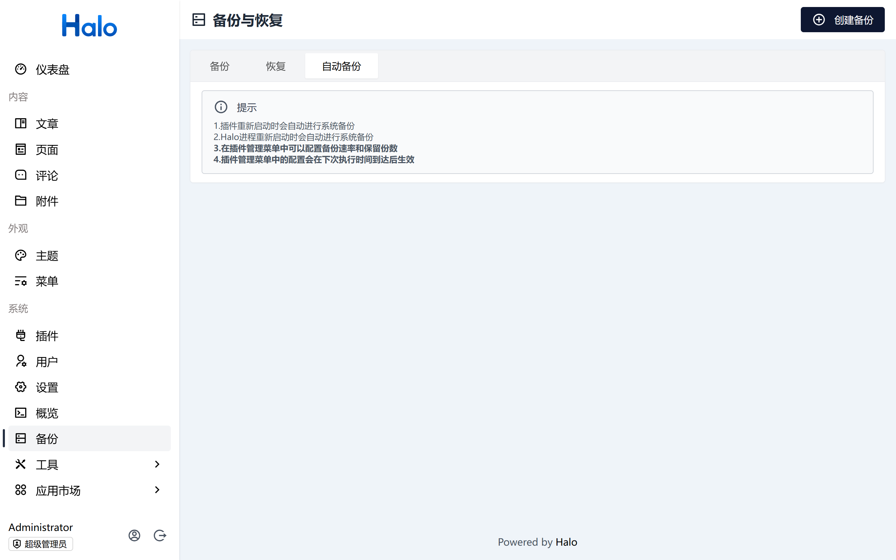

# Halo自动备份插件

## 介绍
Halo自动备份插件，可以定时备份Halo的数据库和文件。

## 使用方式
1. 下载地址：https://github.com/yuxuefenfei/halo-plugin-auto-backup/releases
2. 插件安装：登录Halo后台，在系统->插件->安装->本地上传页面上传插件
3. 插件配置：在系统->插件->Halo自动备份插件->基本设置页面配置备份速率和保留份数
4. 备份速率：支持按小时、天进行周期性备份
5. 保留份数：备份文件保留份数，超过份数后会自动删除最早的备份文件

## 注意事项
1. 插件备份是周期性配置，设置合理阈值可以避免后台备份任务频繁执行而影响系统正常运行
2. 设置合理保留份数，避免备份文件过多占用磁盘空间
